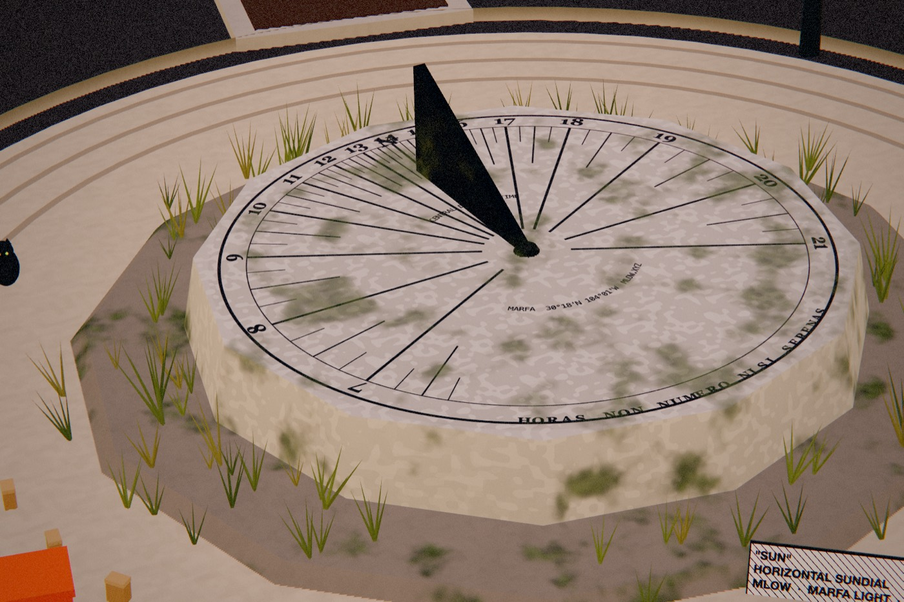

# Marfa Light

**A long-form generative series by MLow.** Every token is a working clock for Marfa, Texas (30.3095° N, 104.0206° W), standing somewhere around town, keeping live Marfa time. The hash decides the clock, how it is made, where it stands, the weather, the wind, the film it is shot on, the label it wears, and what is hidden around it. The sun, the moon and the stars are computed for Marfa and for the minute you are looking.

Working title. Prototype v0.8, October 2026. **Live site: https://0xmlow.github.io/marfa-light/** Made for the Art Blocks x OpenSea Artist Residency in Marfa.



## What is in a token

| | |
|---|---|
| **Clocks** | 29 kinds. Nine read the sky: sundials of every major type (horizontal, analemmatic, armillary, wall, bow, heliochronometer, meridian obelisk, noon cannon) and a nocturnal that reads the stars. The rest keep time by flaps, water, sand, words, pins, gears, fire, bulbs, strokes, wind, neon, and the turning of the Earth under a Foucault pendulum. Each has two or three variation traits of its own. |
| **Places** | 19 places around Marfa and the Big Bend, plus three rare courts of original architecture (Meridian Cloister, Aeolian Court, Contour Passage, about 3% each), each with the real mountain skyline on the horizon. Roofed places refuse clocks that need the sun or the open air. |
| **Easter eggs** | 30 of them, two to seven per token: Marfa, Art Blocks homages, and MLow's own collections. Click one to read about it. |
| **Art Blocks exhibits** | With the artists' written permission, two homages run their own algorithms on real minted tokens. **Chromie Squiggle** (Snowfro): the p5.js script ported line for line to a 2D canvas, 18 real Squiggles across all six types and three rare spectrums; click to loop. **Friendship Bracelets** (Alexis André): his onchain script run unmodified in a sandbox with its own canvases, 14 real bracelets, the Marfa Sunset palette weighted triple; click for the tying instructions. Ringers, Fidenza, Archetype and Meridian stay credited markers. See `src/49-reference-exhibits.js`. |
| **Generative layer** | Nine traits every token carries, from their own stream of the hash: Lens, Framing, Condition, Ground Bloom, Visitors, Light Work, Birds, Sky Event, and a rare Anomaly. Sky events obey the real sky: a rainbow needs a monsoon and a low sun behind you, sun dogs sit 22° from the sun, meteors wait for full dark. |
| **Solar alignment** | Every token keeps one day and one minute of the year: a solstice, an equinox, or its own residency day, at a low sun after rising or before setting, found from the same sun model the dials read. Most tokens build a limestone gate (an oculus, a slot, or two stones) on the line from a bronze marker to the sun at that minute. At the minute, real shadow mapping lets the light through and onto the marker, and the marker glows. Live, it happens once a year. **A** jumps to it. |
| **Ground work** | Land art on the caliche: a stone line laid toward the token's alignment (after Richard Long), a stone circle, raked rings, or cairns. |
| **Weathering** | Every detailed surface carries dust on the faces that look up, rain streaks on the faces that stand, grime where it meets the ground, and worn edges, all in world space and scaled by the token's Condition. |
| **Palette** | About 47% of tokens keep Marfa's own colours. The rest borrow a palette from a collection this work honours, with the artists' permission, for the light and the people in the scene (the fluorescent barrier and its spill, visitors' clothes, luminaria bags, the courts' inlays): **Chromie Spectrum** (12%), the hue run of a real Squiggle from Snowfro's own colour maths, one colour per tube along the barrier; Friendship Bracelets palettes by Alexis André's names (**Marfa Sunset** 9%, PURP, Twinkle in Pink, In the Mountains, MGoBlue!, Neon Lit Diner), sampled from Art Blocks' renders; **NimBuds** (9%) and **NimTeens** (4%), hex colours from Bryan Brinkman's scripts. The sky, stone and clock keep their own colours. See `src/53-palettes.js`. |
| **Squiggle forms** | Ideas from the honoured works, made into Marfa things. **Barrier Form** (with a fluorescent barrier): Straight (Flavin's row), Squiggle (the row laid on a real Squiggle's curve, so from above it traces it), Slinky (hoops of light along that curve), Bold, Ribbed (every third bay dark). **Label Tie**: the safety orange zip tie, or with a borrowed palette a friendship bracelet woven round the label post. **Bloom Tint**: some wildflowers take the palette. **Skywriting** (8%, daylight): every hour on the hour a plane writes the token's own Squiggle across the sky; the smoke spreads on the wind and is gone by the next hour. See `src/54-squiggle-forms.js`. |
| **Sky** | Clear, Scattered, Monsoon (lightning at night), Dust, Blue Norther. The sun, moon phase and stars are real. |
| **Film** | Seven stocks: Clean, Kodachrome, Ektachrome, Velvia, Cinestill (halation), Polaroid, Tri-X (black and white). |
| **Label** | Every clock wears a museum label in quotation marks with one safety orange zip tie. |

The full list, generated from the code, is in [docs/CATALOGUE.md](docs/CATALOGUE.md). How often each trait appears is in [docs/TRAITS.md](docs/TRAITS.md).

## How it keeps time

- **Live** (default): Marfa's real time, Central with daylight saving, computed without a Date object. A token keeps Marfa time wherever it is shown.
- **Time-lapse**: a day in 96 seconds.
- **Residency minute**: the one minute of April 2027 the hash chose, for thumbnails and stills.

The sundials are built for latitude 30.3°. Their hour lines are corrected for Marfa's longitude, 56 minutes behind the Central meridian, so the shadow reads clock time to within the equation of time. About two in three horizontal dials carry a noon mark: a bead on the gnomon whose shadow walks a figure eight through the year (the analemma, computed from the same sun model), and some add the solstice and equinox date lines. Read the bead's shadow against the figure and the dial is right to the minute. After dark the moon casts the same shadow and reads wrong, the way real dials do.

## Controls

| | |
|---|---|
| Drag | walk around the clock |
| Scroll (Ctrl + scroll on a page), pinch | move closer |
| Click | read what you clicked; click the clock for a close-up |
| L / T / S | live, time-lapse, residency minute (or the owner's kept minute) |
| A | go to the token's alignment minute |
| [ ] | an hour back or on |
| , . | a day back or on |
| Space | hold time still |
| C | cycle views: hero, close, wide, ground, plan |
| F | cycle film stocks |
| I | show the token's label (all of its traits) |
| P | save a still (PNG, twice the screen size) |
| G | save three seconds as a GIF |
| Shift G | save the whole day, midnight to midnight, as a GIF |
| ? | all keys |

## Run it

```sh
npm run build     # src/*.js -> marfa-light.js (and site/marfa-light.js)
npm run serve     # then open http://localhost:8317/site/index.html
```

Open `tools/token.html?hash=0x...` for one token full screen, the way Art Blocks shows it.

## Art Blocks

- **Script:** `marfa-light.js`, one file, no build step needed at mint.
- **Dependency:** three.js **r124**, the version Art Blocks stores onchain. Only `*BufferGeometry` class names are used.
- **Input:** `tokenData.hash`. Every feature comes from the hash alone. `calculateFeatures(tokenData)` returns them.
- **Clock:** live mode reads the wall clock on purpose. It is a clock.
- **Network:** none. Textures are computed, text is drawn on canvas, relics are packed into the script.
- **Size:** about 1.16 MB as written, about 720 KB minified (`dist/marfa-light.min.js`). The two relics account for about 65 KB of it. This is large for onchain storage; cutting it down (or splitting the catalogue) is a week-three job with Art Blocks engineering.
- **Traits:** about 24 per token, 94 trait names across the series (measured on 6,000 hashes). `calculateFeatures` returns them.

## ABX and owner settings

The script runs on Art Blocks and on ABX. Under ABX it reads its seed from `abx.tokenData`, reports its traits with `abx.traits()`, signals `abx.done()`, and reads two PostParams the owner can set after mint:

| Key | Type | What it does |
|---|---|---|
| `kept` | Timestamp, token owner | the minute the clock keeps: its still and the S key |
| `label` | String, token owner | up to 24 characters on the museum label, in place of the tag |

Malformed values are ignored, so the hash alone always makes a valid token. Checked with `abx inspect`, `abx preview --schema kept:Timestamp:TokenOwner,label:String:TokenOwner`, and a Base Sepolia `deploy-code --onchain-uri --dry-run` (42 chunks, 25 transactions). The ABX agent skill is installed in `.claude/skills/abx` (`abx skill install --agent claude`).

## Save and share

- In any token: **P** saves a PNG, **G** a three second GIF, **Shift G** the whole day as a GIF. The encoder is part of the script (a median cut palette and LZW), so nothing loads. A three second GIF is about 200 KB; a day is a few MB.
- On the page: the Save row does the same and keeps the files in a tray to open or save.
- From code: `api.saveStill({ long: 3000 })` and `api.recordGif({ day: true, frames: 96, long: 720, download: false })` return promises with the blob.

## Single-file HTML

`npm run standalone` writes two files to `dist/`:
- `marfa-light-standalone.html`: three.js r124 and the engine inlined, about 1.3 MB. Opens from the disk with no network.
- `marfa-light-token.html`: the engine inlined, three.js from cdnjs, the way Art Blocks serves a token.

Both take `?hash=0x...` (64 hex digits) or draw a random token.

## Tools

| Command | What it does |
|---|---|
| `npm run build` | concatenates `src/` into `marfa-light.js`; `node tools/build.js out.js extra.js` builds a private copy with work in progress merged in |
| `npm run page` | writes `site/page.html` (the hosted form) from `site/index.html` |
| `npm run standalone` | writes the two single-file HTML versions |
| `npm run handoff` | assembles `handoff/marfa-light-v0.4/` and its zip |
| `npm run traits` | draws 2,000 hashes and writes the trait distribution to `docs/TRAITS.md` |
| `node tools/docs.js` | writes `docs/CATALOGUE.md` from the registries |
| `npm run render` | renders stills with headless Chrome (no GPU needed) |
| `npm run film` | records a film from real engine frames over the DevTools protocol, then ffmpeg |
| `node tools/export-glb.js 0xHASH 19.5` | exports a token as GLB twice: the whole world (with a Sun light and the hero camera) and the clock alone; `--hashes list.json --out dir` does a batch on the GPU |
| `Blender -b -P tools/blender/render_glb.py -- token.glb token.json out.png` | renders that GLB in Cycles, lit by the real sun for that minute |
| `npm run relics` | re-sculpts the relics in headless Blender and repacks them into `src/06-relics.js` |

## Source

| File | |
|---|---|
| `src/00-core.js` | randomness, noise, Marfa time, sun and moon, the registries |
| `src/05-textures.js` | procedural surface detail projected in world metres (triplanar, with bump) |
| `src/06-relics.js` | Blender relics, quantized and packed |
| `src/10-look.js` | light by solar elevation, sky, stars by sidereal time, moon, clouds, text |
| `src/15-post.js` | HDR, bloom, film grades, grain, vignette |
| `src/20-world.js`, `src/25-places-new.js` | materials, ground, mountains, plants, places |
| `src/30-clocks.js`, `src/35-*.js`, `src/36-*.js` | the clocks |
| `src/26-places-more.js` | eight more places (depot, arroyo, rodeo, ghost town, aerostat field, drive-in, empty pool, hot springs) |
| `src/37-clocks-solar.js`, `src/38-clocks-desert.js` | sky clocks and machines of the high desert |
| `src/40-eggs.js`, `src/45-eggs-new.js`, `src/47-relic-eggs.js` | easter eggs and life |
| `src/48-generative.js` | the generative layer (`genPlan`, `genCamera`, `genBuild`) |
| `src/85-export.js` | PNG and GIF export, with its own GIF encoder |
| `src/80-interact.js` | click captions, help, labels |
| `src/90-main.js` | the plan, world building, the render loop, the API |

To add a clock, a place or an egg, read [docs/ENGINE.md](docs/ENGINE.md). It is one function and one `define...()` call.

## Credits and homages

The design language comes from MLow's virtual architecture practice: Daniel Arsham (the calcified relics), Zaha Hadid (the pavilion), Frank Lloyd Wright (the terrace, Cherokee red), and Virgil Abloh (the quoted labels, the orange zip tie). Easter eggs pay homage to Donald Judd's works at the Chinati Foundation, Elmgreen & Dragset's Prada Marfa, the 1956 film Giant, and Art Blocks projects by Snowfro, Dmitri Cherniak, Tyler Hobbs, Kjetil Golid, Matt DesLauriers and Alexis André. None of this is affiliated with or endorsed by them.

The Marfa lights on the calendar stand where Zach Warren's sight-line study puts them: just under the Chinati skyline at 229 to 238 degrees true from the Viewing Area (203.6 to 210.1 degrees from town), at about magnitude +2.6, showing for about 17 seconds and drifting about 0.9 degrees a minute. Source: Zach Warren, *Separating the known from the unknown at Marfa, Texas*, v1.0, 2026, [doi:10.5281/zenodo.23046856](https://doi.org/10.5281/zenodo.23046856), [github.com/zacharyslate/marfa-lights-investigation](https://github.com/zacharyslate/marfa-lights-investigation). Only his published figures are used, not his code or photographs.

MLow's own worlds appear throughout: NEW YORKERS ([n3wyorkers.com](https://n3wyorkers.com)), fLOWers and The Salon ([mlow.nyc](https://mlow.nyc)), STILL WAITING, THE COMMUTE, BLOOM CYCLE, The MLow Show, and THE SOFT CONSPIRACY, a collaboration with painter Andrés Del Vecchio ([thesoftconspiracy.com](https://thesoftconspiracy.com)). MLow's work has run on 5,000+ NYC taxis and shown in more than ten countries. [mlow.xyz](https://mlow.xyz)

## License

All rights reserved. See [LICENSE](LICENSE).
